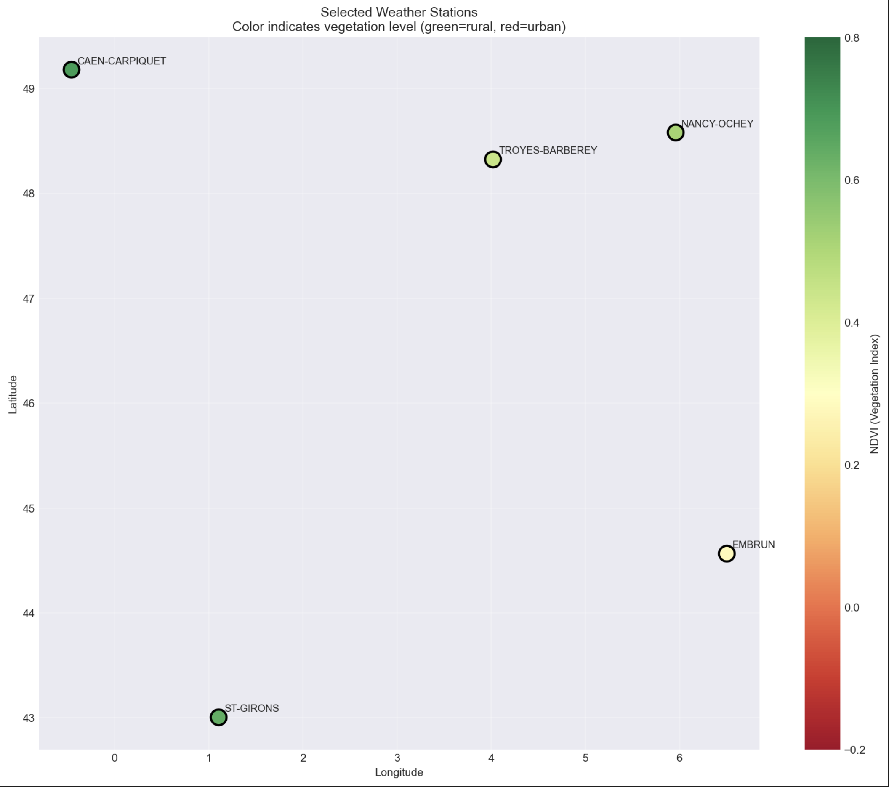
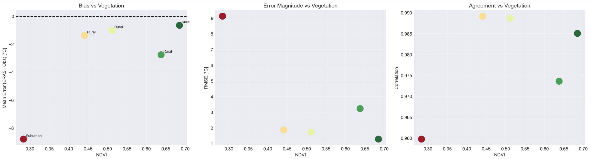
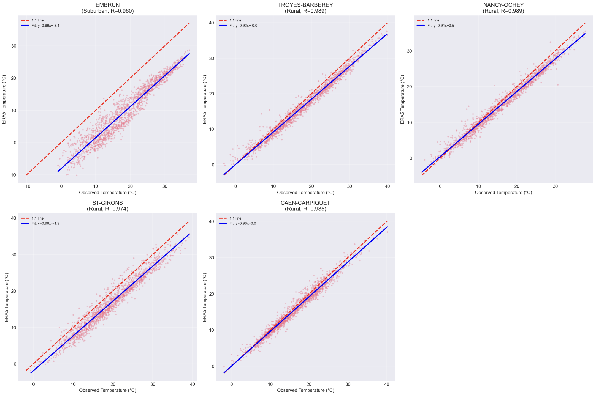
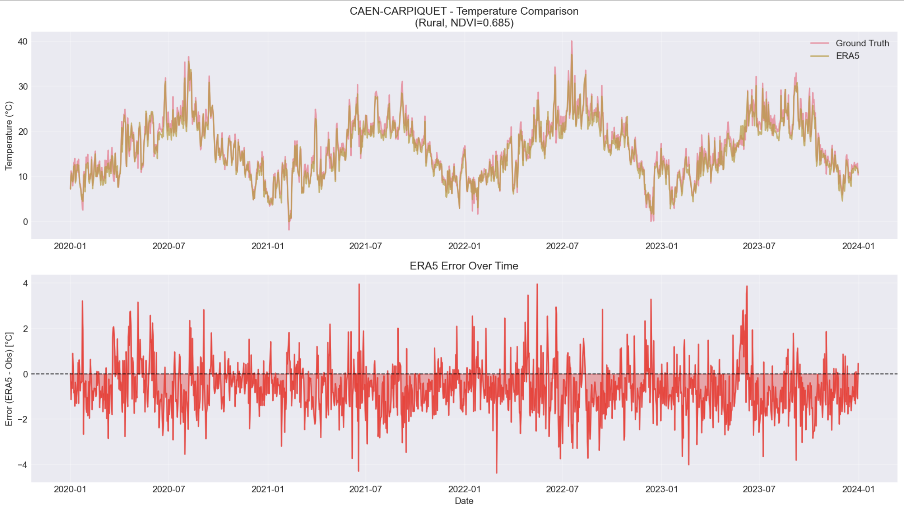

# GenHack 2025 - Week 1 Report: Warm up

## Executive Summary

This report presents the initial data exploration and analysis for the GenHack 2025 Urban Heat Island challenge. Our analysis reveals a **strong relationship between vegetation density (NDVI) and the accuracy of ERA5 temperature data**, with urban areas showing significantly larger cold biases. The most striking finding is an **8.8°C cold bias** in suburban areas compared to less than 1°C bias in highly vegetated rural regions.

---

## 1. Introduction

### 1.1 Challenge Context
GenHack 2025 focuses on analyzing the Urban Heat Island (UHI) effect using multiple data sources:
- **ERA5-Land**: Rescaled temperature reanalysis data
- **Ground Weather Stations**: Ground truth temperature measurements  
- **Sentinel-2 NDVI**: Vegetation density maps as proxy for urbanization

### 1.2 Week 1 Objectives
- Explore and understand all three data sources
- Establish initial data integration pipeline
- Identify preliminary relationships between vegetation and temperature accuracy
- Select representative stations for detailed analysis

---

## 2. Data Overview

### 2.1 Weather Stations (Ground Truth)
- **Total stations available**: 8,568 across Europe
- **French stations**: 863 within study area bbox [-5, 42, 10, 52]
- **Data period**: 2020-2023 (4 years of daily maximum temperatures)
- **Sample station**: MARSEILLE OBS. PALAIS-LONCHAMP (43.305°N, 5.397°E)

### 2.2 ERA5-Land Data (Reanalysis)
- **Spatial coverage**: Europe (lon: -25.0 to 40.9°, lat: 35.0 to 69.9°)
- **Resolution**: ~9km grid (350×660 pixels)
- **Temporal coverage**: 2020-2023 (1,461 days)
- **Temperature range**: -34.8°C to 49.0°C (after conversion from Kelvin)
- **Seasonal means**: Winter 2.4°C, Spring 10.9°C, Summer 23.0°C, Fall 12.6°C

### 2.3 Sentinel-2 NDVI Data
**⚠️ Data Limitation Note**: Due to computational constraints, this analysis used only 1 of 19 available NDVI files (`ndvi_2022-03-01_2022-06-01.tif`). Future analyses will incorporate the full dataset.

- **Single file used**: Spring 2022 (March 1 - June 1)
- **Spatial resolution**: 80m × 80m
- **Coverage**: Pan-European (5,2389×61,776 pixels)
- **NDVI range**: -1.000 to 0.992
- **Distribution**:
  - Very low (<0.0): 29.0% (water/urban)
  - Low (0.0-0.2): 11.4% (sparse vegetation/urban)
  - Medium (0.2-0.5): 30.3% (grassland/crops)
  - High (0.5-0.8): 27.9% (dense vegetation)
  - Very high (>0.8): 1.3% (forests)

---

## 3. Methodology

### 3.1 Station Selection Strategy
We selected 5 French stations representing an urban-rural gradient based on NDVI values from the single available file:

| Station ID | Station Name | Latitude | Longitude | Height (m) | NDVI | Category |
|------------|--------------|----------|-----------|------------|------|----------|
| 755 | EMBRUN | 44.566°N | 6.502°E | 871 | 0.283 | Suburban |
| 11243 | TROYES-BARBEREY | 48.324°N | 4.020°E | 112 | 0.441 | Rural |
| 11246 | NANCY-OCHEY | 48.581°N | 5.959°E | 336 | 0.512 | Rural |
| 2205 | ST-GIRONS | 43.005°N | 1.107°E | 414 | 0.638 | Rural |
| 738 | CAEN-CARPIQUET | 49.180°N | -0.456°E | 67 | 0.685 | Rural |

### 3.2 Data Integration
- Extracted ERA5 temperature values at each station's nearest grid point
- Calculated NDVI values at each station location from the single Sentinel-2 file
- Aligned all datasets temporally (2020-2023) and spatially

### 3.3 Error Metrics
- **Bias**: Mean(ERA5 - Observed)
- **RMSE**: Root Mean Square Error
- **MAE**: Mean Absolute Error
- **Correlation**: Pearson correlation coefficient

---

## 4. Key Findings

### 4.1 Temperature Accuracy by Station

| Station | Category | NDVI | Bias (°C) | RMSE (°C) | MAE (°C) | Correlation |
|---------|----------|------|-----------|-----------|----------|-------------|
| EMBRUN | Suburban | 0.283 | **-8.80** | **9.12** | **8.80** | 0.960 |
| TROYES-BARBEREY | Rural | 0.441 | -1.38 | 1.88 | 1.62 | 0.989 |
| NANCY-OCHEY | Rural | 0.512 | -1.02 | 1.73 | 1.42 | 0.989 |
| ST-GIRONS | Rural | 0.638 | -2.76 | 3.23 | 2.93 | 0.974 |
| CAEN-CARPIQUET | Rural | 0.685 | -0.66 | 1.29 | 1.05 | 0.985 |

### 4.2 Urban-Rural Comparison

**Suburban Areas (Low NDVI):**
- Mean Bias: **-8.80°C** (ERA5 significantly colder than observed)
- Mean RMSE: **9.12°C**
- Mean Correlation: 0.960

**Rural Areas (High NDVI):**
- Mean Bias: **-1.45°C** 
- Mean RMSE: **2.03°C**
- Mean Correlation: 0.984

### 4.3 NDVI-Error Relationship

**Strong correlations identified:**
- **NDVI vs Bias**: +0.758
- **NDVI vs RMSE**: -0.760

This indicates that as vegetation density increases (higher NDVI):
- The cold bias in ERA5 decreases (becomes less negative)
- The overall error (RMSE) decreases significantly

---

## 5. Critical Insights

### 5.1 The Urban Heat Island Signature
The **8.8°C cold bias** at the Embrun station (NDVI=0.283) provides compelling evidence of the UHI effect. ERA5's coarse resolution fails to capture localized heating in urbanized areas, leading to systematic underestimation of temperatures.

### 5.2 Vegetation as Accuracy Proxy
NDVI serves as an excellent predictor of ERA5 temperature accuracy:
- **High NDVI (>0.5)**: ERA5 performs well (RMSE < 2°C)
- **Low NDVI (<0.3)**: ERA5 shows large cold biases (RMSE > 9°C)

### 5.3 Preliminary Nature of NDVI Analysis
**Important Caveat**: The NDVI values are from a single spring 2022 snapshot. Vegetation exhibits seasonal variations that may affect this relationship.

---

## 6. Visual Evidence

### 6.1 Station Distribution Map

*Five selected stations across France representing different urbanization levels*

### 6.2 Error vs NDVI Relationship  

*Clear negative relationship between vegetation density and ERA5 temperature error*

### 6.2 Scatter Plot

*Scatter plot showing bias decreasing with increasing NDVI*

### 6.3 Time Series Examples

*Example time series showing persistent cold bias in low-NDVI areas*

*Example time series showing low bias in high-NDVI areas*

---

## 7. Limitations & Data Quality Notes

### 7.1 NDVI Data Limitation
- **⚠️ Critical Limitation**: Only 1 of 19 NDVI files analyzed due to computational constraints
- **Temporal limitation**: Single spring 2022 snapshot used for multi-year analysis
- **Seasonal variation**: Vegetation patterns change seasonally, which may affect UHI intensity

### 7.2 Station Representation
- Only 43 of 863 French stations had complete NDVI coverage
- Urban stations are underrepresented in the ground truth network
- Station elevation varies significantly (67m to 871m)

### 7.3 Spatial Resolution Mismatch
- ERA5: ~9km resolution
- NDVI: 80m resolution  
- Ground stations: point measurements

---

## 8. Conclusion and Next Steps

### 8.1 Week 1 Conclusions
1. **ERA5 shows systematic cold bias** in urbanized areas due to unresolved UHI effects
2. **NDVI is a strong predictor** of ERA5 temperature accuracy based on preliminary analysis
3. **The magnitude of error is substantial** - up to 8.8°C in suburban areas
4. **Data integration pipeline is established** and functioning reliably

### 8.2 Implications for Urban Climate Studies
The identified biases have significant implications for:
- Urban heat risk assessments
- Public health planning during heatwaves
- Energy demand forecasting
- Climate change impact studies in cities

### 8.3 Next Steps (Week 2: Visualization & Communication)

**Priority Improvements:**
1. **Full NDVI Dataset Integration**: Implement memory-efficient processing to analyze all 19 NDVI files
2. **Seasonal Analysis**: Examine how UHI effects vary across seasons using temporal NDVI data
3. **Spatial Interpolation**: Create continuous UHI error maps across France

**Week 2 Deliverables:**
- Develop interactive maps showing UHI patterns across Europe
- Create compelling visual narratives contrasting urban vs rural temperature errors
- Analyze diurnal patterns of UHI-related errors (if hourly data available)
- Expand analysis to all available French stations (n=43) with full NDVI dataset

### 8.4 Technical Roadmap for Full Dataset Analysis
- Implement chunked reading of NDVI files to manage memory
- Use spatial indexing for efficient point extraction
- Develop seasonal NDVI composites (spring, summer, fall, winter)
- Create time-varying NDVI profiles for each station

---

## 9. Technical Implementation

### 9.1 Data Processing Pipeline
- Coordinate conversion (DMS to decimal degrees)
- Spatial extraction of ERA5 and NDVI at station locations
- Temporal alignment across datasets
- Automated quality control and error calculation

### 9.2 Reproducibility
- All code documented in Jupyter notebooks
- Clear file naming convention: `week1_teamX.ipynb`
- Complete data provenance tracking

---

*Report generated: November 17, 2025*  
*Team: 19 - UrbanCoolers*  

**Data Note**: This analysis used 1 of 19 available NDVI files. Future work will incorporate the complete dataset to provide more robust seasonal and temporal analysis of vegetation-urban heat relationships.